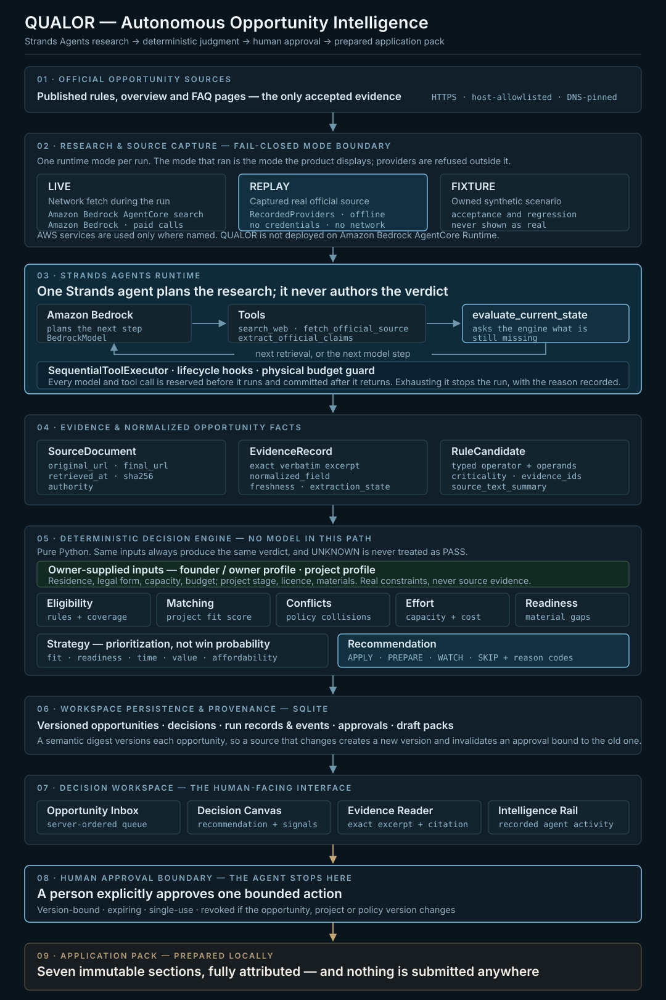

# QUALOR

**Autonomous Opportunity Intelligence**

Find what qualifies. Pursue what matters.

## What QUALOR is

QUALOR is autonomous opportunity intelligence for founders and small technology or creative teams. It discovers opportunities, verifies evidence and blockers against real project constraints, and prepares the next decision for human approval.

This describes the intended product. The authoritative specification is [the canonical brief](docs/00_CANONICAL_BRIEF_UA.md).

## Current development status

**AWS Agents for Humans 2026 build**

The end-to-end path works: a Strands agent researches official sources, deterministic engines
judge, the decision workspace presents the result with its evidence, a human approves, and an
application pack is prepared locally. Nothing is ever submitted externally.

- **Agent runtime** — one Strands `Agent` with four tools, sequential tool execution and
  lifecycle hooks enforcing a physical call budget: [`src/qualor/runtime/agent.py`](src/qualor/runtime/agent.py).
- **Deterministic decision core** — eligibility, matching, conflicts, effort and capacity,
  readiness and strategy compose into APPLY, PREPARE, WATCH or SKIP. Strategy is internal
  prioritization, never a probability of winning. No model sits in this path.
- **Workspace** — versioned opportunities, decisions, run records and events, version-bound
  approvals and immutable draft packs, persisted in SQLite with full provenance.
- **Decision workspace UI** — opportunity inbox, decision canvas, evidence reader with exact
  source excerpts, and a recorded activity rail.

Runtime mode is fail-closed. `LIVE`, `REPLAY` and `FIXTURE` are distinct, a run gets exactly
one, and the mode the product displays is the mode that actually ran.

Not built, and not claimed: Amazon Bedrock AgentCore Runtime deployment, a hosted live demo,
and any external submission capability.

Per-phase measured results are recorded under [docs/status/](docs/status/).

## Architecture



Python 3.12, Pydantic v2 and FastAPI on the backend; React, TypeScript, Vite and Tailwind v4
on the frontend. Pydantic owns the domain contracts and the exported JSON Schema, which
generates the frontend types — no domain interface is hand-maintained on either side.

The decision core is pure Python and imports no AWS, network or agent client. The Strands
agent is confined to research: it chooses what to read, never what the answer is.

Two AWS services are used, and only in the `LIVE` provider path: Amazon Bedrock for the model,
and Amazon Bedrock AgentCore **search**. QUALOR is **not** deployed on Amazon Bedrock AgentCore
**Runtime** — a provider integration and a runtime deployment are different things, and only
the first exists here.

## Local development

Install Python 3.12, uv, Node (version in `.node-version`), npm and Git. From the repository root:

```powershell
uv sync --locked
uv run qualor doctor
uv run uvicorn qualor.api:app --host 127.0.0.1 --port 8000
```

`GET http://127.0.0.1:8000/health` reports bootstrap health. In another terminal:

```powershell
npm --prefix apps/web ci
npm --prefix apps/web run dev -- --host 127.0.0.1
```

The frontend displays the bootstrap shell. Non-secret defaults are documented in `.env.example`. Live configuration is rejected during bootstrap.

Evaluate the owned gold fixtures and regenerate domain schemas:

```powershell
uv run qualor evaluate-fixture tests/fixtures/F01_FULL_PASS.json
uv run qualor decide-fixture tests/fixtures/decisions/D01_ELIGIBLE_HIGH_SCORE_READY_APPLY.json
.\scripts\export-schemas.ps1
.\scripts\export-schemas.ps1 -Check
.\scripts\generate-types.ps1
.\scripts\generate-types.ps1 -Check
```

The CLI prints `MODE=FIXTURE`, `ELIGIBILITY=...` and the structured gate. `POST /dev/evaluate-fixture` accepts the same JSON envelope directly; it never accepts a filesystem path. This route returns 404 outside `QUALOR_ENV=development`. Run the API on loopback as shown above. It performs no persistence or external call. A FAIL or REVIEW_REQUIRED is a successfully evaluated fixture; malformed input exits nonzero in the CLI or returns HTTP 422 in the API.

`decide-fixture` prints eight status lines, including the selected project, score and recommendation. Unknown scores remain `UNKNOWN`; ties or insufficient matching evidence leave the project `UNRESOLVED`. `POST /dev/decide-fixture` accepts structured fixture JSON and returns the full assessments, reason codes, explanation and missing information. Its candidate decisions are conditional analyses; an unresolved portfolio does not choose a candidate. Both development routes are unavailable outside development, and neither performs an external submission.

Public APIs and policy details are documented in the [eligibility plan](docs/superpowers/plans/2026-09-05-qualor-01-domain-eligibility-core.md) and [decision plan](docs/superpowers/plans/2026-09-05-qualor-02-decision-core.md). Forty-two canonical domain contracts are exported to `schemas/`, one JSON Schema file each, and those files generate [frontend domain types](apps/web/src/generated/domain.ts) with pinned [json-schema-to-typescript](https://github.com/bcherny/json-schema-to-typescript). Install frontend dependencies before generation. No domain interfaces are hand-maintained. TypeScript describes serialization shapes; Python remains responsible for numeric bounds, date/decimal formats, uniqueness, evidence checks and cross-field rules.

```powershell
.\scripts\verify.ps1
.\scripts\aws-preflight.ps1
```

Verification includes a clean Git worktree gate, so commit intended changes before the final run. Stop the frontend dev server first on Windows: `npm ci` reinstalls native packages that the running server can lock. Preflight performs separate read-only AWS metadata checks; missing access is reported as blocked. Its detailed output stays in ignored `.qualor/local/`. The doctor and CI do not contact AWS.

### Running the decision workspace

The commands above reach the bootstrap shell. To run the actual product, seed a workspace and
start both servers against the same database. No AWS credentials and no network access are
required, and no paid call is made.

```powershell
$env:QUALOR_ENV = "development"
$env:DATABASE_PATH = "$PWD\.qualor\local\workspace.db"

uv run qualor seed-workspace-fixture tests/fixtures/workspace/W01_DECISION_TO_DRAFT_PACK.json
uv run qualor serve --port 8000
```

In a second terminal:

```powershell
npm --prefix apps/web run dev
```

Open `http://127.0.0.1:5173/inbox`, select the seeded opportunity, and the full path is
available: decision, evidence reader, recorded activity, human approval and the application
pack. The seeded scenario is an owned `FIXTURE` and is labelled as such throughout.

The browser acceptance suite drives this same stack end to end:

```powershell
npm --prefix apps/web run test:e2e
```

## Safety boundaries

No external application submission exists anywhere in this repository, and no code path
performs one. Paid inference and live search run only under an explicit `LIVE` opt-in with a
physical budget guard; the default path makes no paid call, and the doctor, the test suites and
CI never contact AWS. Discovery of model metadata does not prove inference permission. FIXTURE,
REPLAY and LIVE are distinct and fail closed. Approvals are version-bound, expiring and
single-use. Keep credentials, `.env` and runtime data out of Git.

## License

[MIT](LICENSE), copyright 2026 Rostyslav Brenych.
